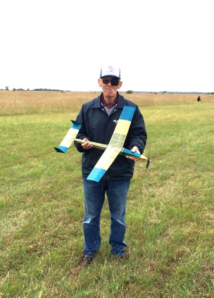

# Biography

In 1956, I was on a quest to figure out how airplanes fly. I was 10 years old!
As a kid growing up in Washington D.C. I was already building model airplanes,
mostly control-line Sterling models. That year Paul Poberezeny published an
article in *Mechanics Illustrated* that showed how to build a real airplane at
home: the *Baby Ace*. I discovered that building models could lead to building
full-sized airplanes. Eventually I joined the Experimental Aircraft
Association, which Paul founded to promote home building.

Much of my growing up time was spent wandering in the halls of the Smithsonian
where many famous airplanes were on display. Shortly after Paul's article was
published I found myself in the offices of the *American Aviation Historical
Society* in the Arts and industries building of the Smithsonian. That place had
an amazing collection of publications covering the history of
aviation. I once found myself holding a post card written by Glen Curtis and
sent to Orville Wright! On one of those visits there, I was introduced to none
other than Paul Poberezeny himself, who was standing in the hallway with Dr.
Paul Garber, who eventually was named Curator Emeritus of the *National Air and
Space Museum. Wow! I met two such important men in the history of aviation, and I
was just imagining a career in aviation!

My passion for flight took me through college where I earned degrees in
Aerospace Engineering, then into my career in the as an officer in the USAF. My
first assignment in the Air Force involved conducting research in the emerging
field of *Computational Fluid Dynamics*. While working there, I was introduced to
first-generation supercomputers, and my career shifted direction into Computer
Science. Based on that experience, I was invited to teach computer science at
the Air Force's graduate engineering school.

Early in my Air Force career, I became a private pilot, and got my Commercial
Pilot's license as well. I also learned how to fly aerobatics so I would better
understand how to control a real airplane. I continued as a member of the EAA,
eventually attending 25 successive annual fly-in's at Oshkosh! Sadly, during
that time, my model building was put on hold, although I maintained my
membership in the AMA.

I spent 20 years in the Air Force doing research and teaching Computer Science.
Eventually I was assigned to manage a research supercomputer center in New
Mexico. After retiring, I started a second career, again teaching computer science in
Texas, and finally retired for good in 2018.

Since then, I have become a member of the *Heart of America Free Flight
Association*, and am again active in building and flying rubber powered free
flight models. I am right back where I started all those years ago.

Currently, my wife and I are enjoying our retirement, and finding time to
pursue hobbies we love. My goal now is to continue my teaching, combining both
of my career paths by building computer tools to assist in designing, building
, and flying model airplanes. My goal is to help introduce another generation
of folks to this fascinating world of flight.

